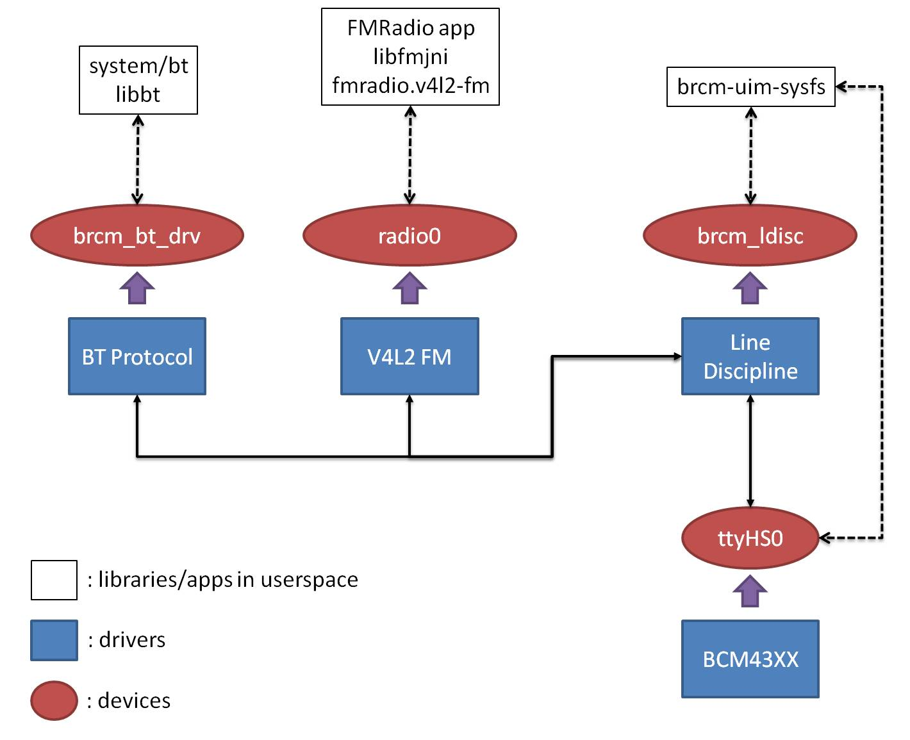

# BT_BCM_COMBO
This is a revision of Broadcom V4L2 BT/FM combo driver ported from drivers/bluetooth/broadcom in this [repository](https://github.com/sonyxperiadev/kernel/tree/aosp/LE.UM.2.3.2.r1.4).

## Disclaimers
1. All hardware-related controls/settings simply follow the original implementation, which has only been checked with my specific test device at hand; thus, what other chips these drivers can also work with remains unclear. This is especially true when it comes to FM radio functionalities, where various private commands (wrapped in HCI packets) are used to communicate with the chip.

2. The original implementation also includes packet snooping for debugging, but this function has never been enabled (and therefore has never been checked and confirmed working) throughout my testing. 
   
3. Only limited tests have been conducted with my device; so while you are welcome to apply/adapt it to other use cases, please do verify its correctness/robustness and ***use it at your own risk***.

## Changes
1. Allowing for HCI packets transmitted in a sequence of small fragments between the userspace and BT protocol driver (and in turn Line Discipline driver), so all components remain functional no matter how packets are read/written. \
   \
   For example, the BT stack in my test environment sent each HCI packet in small chunks (packet type -> header -> data) rather than the entire content as a whole; it also seemed to expect data coming back in the same way, since the timeout it used was quite small that the delay in accumuating data until a complete packet at the driver level could easily run over that limit. This modification enables drivers to handle that kind of communication behaviour.
   
2. Updating the Line Discipline driver to support "synchronous mode", in which internal senders (being BT protocol driver, V4L2 FM driver, or Line Discipline driver itself) are blocked (with a timeout) waiting for the response to the request they have just sent. \
   \
   This change helps to simplify the original implementation, where each sender had to build its own way of synchronisation with synchronisation points (where waiting actually happens) scattered around the code. However, it should be noted that this new synchronisation mechanism is realised by matching responses with requests of the same "sync ids" generated based on their packet type + opcode; as a result, it still fails to distinguish responses in some edge cases (as the original implementation did), like two consecutive responses of the same type and the same opcode are received in reply to two consecutive requests, but the second request might end up matching the first response as the first request happened to be sent in "asynchronous mode".
   
3. The use of spin locks has been largely revised to
   * Reduce the sizes of critical sections.
   * Remove unnecessary on/off switches on interrupts, as all locks are supposed to be used in the context of "kernel processes/threads".
   * Be not spin-locked when sleeping might be triggered (e.g. copy_to_user() is going to be called).
   
4. tx/rx queuing is streamlined so that only one queue is used for each direction (a shared tx queue is installed at Line Discipline driver, while BT protocol driver and V4L2 FM driver are both equipped
   with a rx queue).
   
5. Exposing the interface (via V4L2 control) of configuring FM radio with regional band presets defined by V4L2 FM driver.

6. Creating one fake platform device associated with Line Discipline driver in module_init() instead of declaring it using dts, as that device requires no property configuration, and the fact that only one device (the one bound to index 0) would ever be used in the original implementation suggests that a single device should be sufficient.


## Build
In my case, drivers are compiled under a kernel tree, and this can be done by
1. Copy the downloaded folder into the target kernel tree; e.g. it can be placed at ${KERNEL_ROOT}/drivers/bluetooth/BT_BCM_COMBO, where ${KERNEL_ROOT} is the path to the root of that kernel tree.
   
2. Given the driver folder is at ${KERNEL_ROOT}/drivers/bluetooth/BT_BCM_COMBO, edit ${KERNEL_ROOT}/drivers/bluetooth/Kconfig to include the following line:
   ```Kconfig
   source drivers/bluetooth/BT_BCM_COMBO/broadcom/Kconfig   
   ```
   
3. Edit ${KERNEL_ROOT}/drivers/bluetooth/Makefile to include the following line:
   ```Makefile
   obj-y += BT_BCM_COMBO/broadcom/
   ```
   
4. Reconfigure to enable BCM_COMBO_BT_PROTOCOL, BCM_COMBO_LINE_DISCIPLINE, and BCM_COMBO_V4L2_FM components. \
   Note that there are dependencies imposed through the Kconfig; so if you modify your build configuration file manually, please make sure that (assuming all modules are built into the kernel image directly)
   ```
   CONFIG_BT=y
   CONFIG_FW_LOADER=y
   CONFIG_VIDEO_V4L2=y
   CONFIG_BCM_COMBO_BT_PROTOCOL=y
   CONFIG_BCM_COMBO_LINE_DISCIPLINE=y
   CONFIG_BCM_COMBO_V4L2_FM=y
   ```
   are included in the configuration.
   
5. Perform the kernel/module build as desired.

## Diagram
Please be cognizant of the requirement that these drivers have to collaborate with other modules/userspace apps to become fully functional. As an illustration, below is a simple diagram showing all components involved in my setup targeting lineage-18.1 OS: \
 \
And for reference, here are the repositories where components in the diagram were found:
* [system/bt](https://github.com/LineageOS/android_system_bt/tree/lineage-18.1)
* [libbt](https://github.com/LineageOS/android_hardware_broadcom_libbt/tree/lineage-18.1)
* [brcm-uim-sysfs, fmradio.v4l2-fm, libfmjni](https://github.com/LineageOS/android_hardware_broadcom_fm/tree/lineage-18.1)
* [FMRadio app](https://github.com/LineageOS/android_packages_apps_FMRadio/tree/lineage-18.1)

